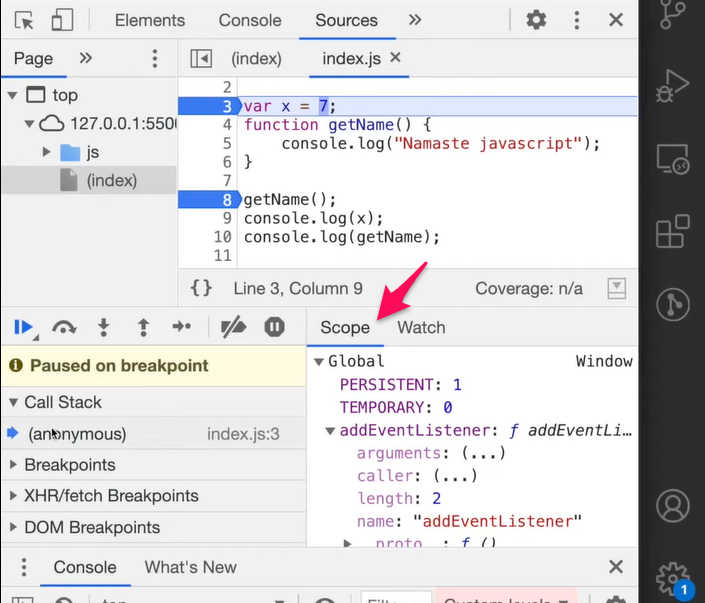
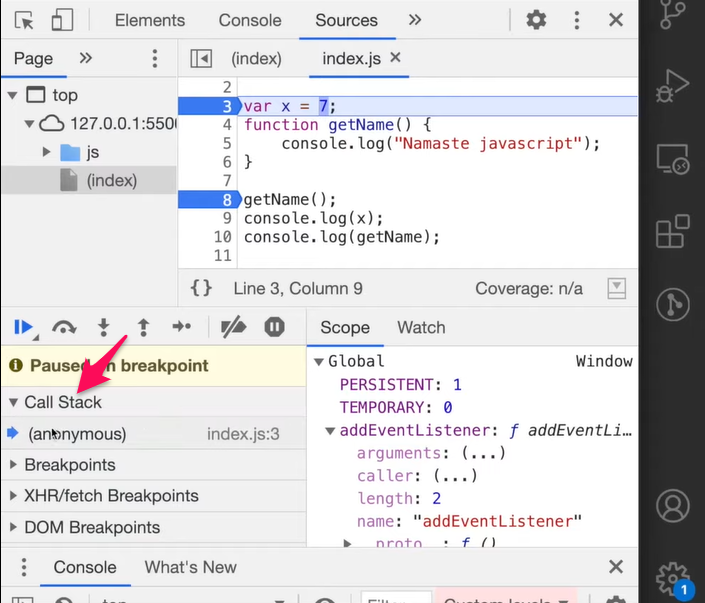
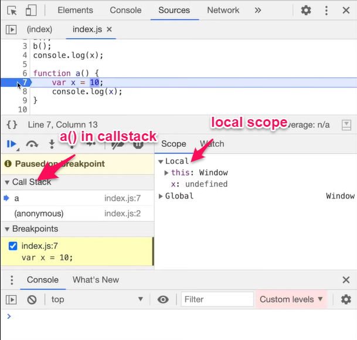
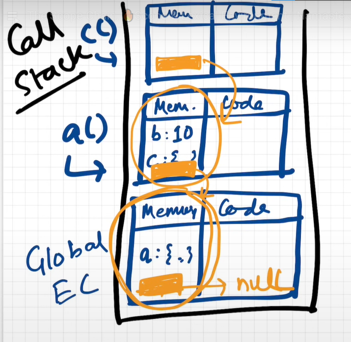
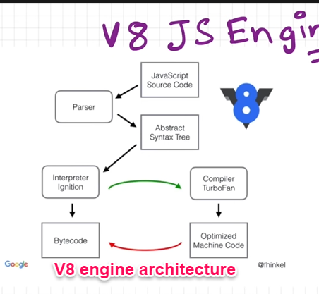

# silver-fiesta
Showing off my very very basic node js skills ;) 

[Evenote Reference](https://www.evernote.com/shard/s343/sh/82df2599-9c64-b997-858e-5226ce01337c/390f63bfbb77d8e8338837829aac38eb)
References from where this repo's content is derived from:

- https://www.youtube.com/playlist?list=PLlasXeu85E9cQ32gLCvAvr9vNaUccPVNP

How JS works | Execution Context
https://youtu.be/ZvbzSrg0afE
- Everything in javascript happens inside the execution context
- 2 components
	- memory component (variable environment)
		- variables and functions are stored in key-value pairs
	- code component (thread of execution)
		- code executed line by line
- Javascript is a synchronous single threaded language(checkout How NodeJS works in NodeJS)
---
How JS code is executed | call stack
https://youtu.be/iLWTnMzWtj4
- 
```
var n = 2;
function square(num){
    var ans = num * num;
    return ans
}
var square2 = square(n);
var square 4 = square(4);
```
- Execution context is created in 2 phases
	- memory creation phase
		- skims the program line-by-line and allocate memory to all variables and functions
		- steps:
			- allocate memory for "n" (saves it as undefined)
			- allocate memory for  functions "square()" (literally the code of function)
			- allocate memory for "square2" (saves it as undefined)
			- allocate memory for "square4" (saves it as undefined)
	- code execution phase
		- runs through the whole program line-by-line
		- steps
			- places value 2 in "n" (which was previously undefined)
			- from line 2 to 5 there is nothing to execute so move on to next line
			- now we get function execution, every function when invoked will create a brand new execution context which again has
				- memory component
					- allocate memory for "num" which is a function param (saves it as undefined)
					- allocate memory for "ans" (saves it as undefined)
				- code execution component
					- value of "n" (argument) is passed to "num" (param)
					- put num*num inside ans (which was previously undefined). Now ans = 4
					- return the control back to the execution context where this function was invoked
				- this child execution will be deleted
			- value of "square2" will now be the value returned by child execution context ie 4 (which was previously undefined)
			- now we again get a function executions, so again a saperate execution context is created
- To manage every execution context JS uses a call stack
	- every time at the bottom of the stack we have global execution context
	- whenever a new execution context is created it is pushed to this stack
	- whenever top inserted execution context is done executing it is popped of the stack and then control moves to the next execution context
	- callstack maintains the order of execution of each execution context
	- other names for call stacks
		- Execution context stack
		- program stack
		- runtime stack
		- control stack
		- machine stack
---
Hoisting in Javascript (Variables and functions)
https://youtu.be/Fnlnw8uY6jo
- files
	- hoisting-1.js
	- hoisting-2.js
- By Hoisting you access the variables and functions even before initializing it without any error.
- Hoisting for variable:
```
    console.log(x); // this will give undefined
    var x = 7;
```
	- the above scenario is due to the fact that every variable decalred inside a code will get a special placeholder defined to it which is "Undefined"
```
    console.log(x) // ERROR: x is not defined
```
	- here instead of undefined we get Error: not defined because in the memory allocation the compiler could not find x and hence when in the execution context this line was executed it gave an error
- Hoisting for functions
	- functions will behave differently incase of hoisting
	- in the memory allocation phase, the entire function gets stored in the memory (literally)
	- due to which for following scenario, it gives the correct output
```
    getName() // Hitesh
    function getName(){
        console.log('Hitesh')
    }
```
- a trick to view stop the compilation in memory component
	- write a js code, run in the browser
	- go to chrome tools > sources > our script
	- put a debugger on the first line
	- refresh the page
	- go in the scope, here you will see all the variables and functions already there even before the code is executed(since it is paused on the first line itself)
	  

	- incase of an arrow function, the following will give an error
```
    getname2() // getname2 is not a function
    var getname2 = () => { 
        console.log('hellow');
    }
```
	- since arrow functions are stored inside a variable
	- hence in the memory component getname2 will be assigned a value undefined since it is a variable

- Call stack in browser:



---
How Functions are executed in JS
https://youtu.be/gSDncyuGw0s

```
var x = 0;
a();
b();
console.log(x); //0

function a() {
    var x = 7;
    console.log(x); //7
}

function b() {
    var x = 100;
    console.log(x); //100
}
```

- Execution of above program
	- create a global execution context
	- push this GEC(Global Execution Context) inside the callstack
	- inside this GEC,
		- memory allocation
			- allocate memory to
				- var x (initially undefined)
				- function a(), (code itself)
				- function b() (code itself)
		- code execution
			- var x = 0
			- fun a() is invoked
				- an execution context for this function is created and pushed to the call stack. Inside this function execution context
					- memory allocation
						- allocate memory to,
							- var x = undefined (this x is separate variable then the x in GEC)
					- code execution
						- var x = 7
						- console.log(x) // 7
				- this execution stack will be deleted from call stack
			- now fun b() is invoked
				- an execution context for this function is created and pushed to the call stack. Inside this function execution context
				- memory allocation
					- allocate memory to,
						- var x = undefined (this x is separate variable then the x in GEC)
				- code execution
					- var x = 100
					- console.log(x) // 100
				- this execution stack will be deleted from call stack
			- console.log(x) // 0
	- Delete the GEC
- For more clarity check the execution of this function in browser using debugger, scope and callstack



---
Window and this keyword
https://youtu.be/QCRpVw2KXf8
- window
	- always points to GEC
	- whenever JS code is executed it is the responsibility of the engine that is executing it to create some variables pointing to the GEC
	- incase of browsers(v8) it is called as window
	- incase of node it is called as global
- this
	- at the global level this points to the GEC
```
var a = 10;
function a(){
    var x = 20;
}
console.log(window.a) // 10
console.log(a) // 10
console.log(this.a) // 10
console.log(x) // ERROR: X is not defined
```

---
Undefined vs Not defined
https://youtu.be/B7iF6G3EyIk

```
var a;
console.log(a); // undefined
a = 10;
console.log(a); // int 10
a = 'hitesh';
console.log(a); // string hitesh 
```

---
Scope, Scope chain and Lexical environment
https://youtu.be/uH-tVP8MUs8

```
function a() {
    console.log(b); // 10
}
var b = 10;
a();
```
- somehow in the EC of a() it finds the value of variable b from the GEC 

```
function a() {
    c();
    function c() {
        console.log(b) // 10
    }
}
var b = 10;
a();
```
- you can access the variables declared in GEC inside the EC of a function which is already inside the EC of another function

```
function a() {
    var b = 10;

    c();
    function c() {
        console.log(b) // 10
    }
}

a();
console.log(b) // ERROR: not defined
```
- the reverse of above two cases is not true

- scope: 
	- where you can access the specific var for fun in your code
	- scope is directly dependant on the lexical environment
- Lexical environment
	- Whenever an EC is created, a lexical environment is also created. 
	- Its the local memory along with Lexical environment of its parent
	- lexical, literally means hierarchy
	- in our case c() is lexically sitting inside  a() ie. code for c() is physically inside a()
	- and a() is lexically inside the global scope
	- whenever EC is created, you get reference to the lexical environment of its parent
	- GEC also has reference to the lexical environment which is null
	- so Finally Lexical Environment = local memory + Lexical Environment of Parent
	- 

	  
	  
- Scope Chaining:
```

function a() {
 

    c();
    function c() {
        console.log(b) // 10
    }
}

var b = 10;
a();

```

	- lets take the example of above code, when you do console.log(b) in c() it searches for var b in the EC of c()
	- it couldn't find it, so it moves on to EC of a() this is possible because inside EC of c() the lexical reference of a()'s EC is stored
	- it couldn't find var b inside EC of a() as well. Now in the EC of a() there exists a lexical reference of GEC, so it moves on to finding var b in GEC
	- now here it finds the value of var b, which is passed to EC of a() and then EC of c()
	- this as we can see is like a linked list
	- this is called scope chaining
---
Let & Const in JS | Temporal Dead Zone
https://youtu.be/BNC6slYCj50
- Are let and const hoisted in JS
	- Yes, these are in Temporal Dead Zone for the time being
	- example,
```
console.log(b) // undefined
console.log(a) // ERROR: cannot access variable `a` before initialization

let a = 10;
var b = 100;
```

- Here the reason why let gives an error is
	- incase of var, the memory is assigned to var and it is saved in GEC
	- but incase of let and const, the assigned memory is not stored in GEC but are stored in separate memory space, which you cannot access unless you assign some values to it
	- a demo of which can be seen if you do window.b you will get the value but if you do window.a you will get undefined, which proved a is not stored inside GEC
- Temporal Dead Zone : Time between the let variable initialization and the value assignment for that particular let variable
- To avoid TDZ,
	- always put all your declarations on the top, this shrinks TDZ window to 0
- For our code the temporal dead zone(TDZ) for let variable a is from line 1 to 3
- if you try to access a let or const variable inside the TDZ it will give reference error, which is the same what we get when we do not initialize the variable Error: not defined
- SyntaxError:
```
let a = 10;

let a = 100; // SyntaxError Identifies is already been declared

const b = 1000;

const b  = 10000; // SyntaxError Identifies is already been declared
```

- const
	- this is stricter then let
	- for let initialization first and value assignment later is allowed ie,
```
let a;

...some code...

a = 100;
```

	- but when you do the same with const you get SyntaxError: Missing Initializer in const declaration
- if you try to assign the value to const again ie.
```
const a = 100;

const a = 1000; // ERROR
```

- you get TypeError: Assignment to constant variable
- So we have seen 3 types of error
	- SyntaxError : if the code is not according to JS standard 
	- ReferenceError : Tries to find a specific var in memory but you cannot access it
	- TypeError : Trying to change the type of the variable or behaving with a type not according to its specification
---
Block Scope and shadowing in JS
https://youtu.be/lW_erSjyMeM
- Block
	- also known as compoud statement
	- used to combine multiple JS statement in a single group
	- for example { ...JS statements... }
	- reallife example, The actual syntax of if is something like this,
```
        if() return a;
```

	- ie. it expects single statement after if() 
	- but incase if we want to write muliple statement we use a block and wrap our code inside this block ie. { and } 
- Block Scope:
	- whatever var and fun we access inside the block
	- example
```
        {
            var a = 10; // this is hoisted in GEC
            let b = 20; // this is hoisted in the memory space resoved for this particular block
            const c = 30; // this is hoisted in the memory space resoved for this particular block
            console.log(a) // 10
            console.log(b) // 20
            console.log(c) // 30
        }
console.log(a) // 10
console.log(b) // Reference Error variable b is not defined
console.log(c) // Reference Error variable c is not defined
```

- Shadowing
	- if you same named variable outside the block, the variable inside the block shadows that particular variable which is present outside the block
	- example
```
        var a = 100;
        let b = 200;
        {
            var a = 10; // this replaces the value of variable `a` inside the GEC 
            let b = 20; // this assigns the value of variable `b` inside the Block Scope


            console.log(a) // 10 shadowed
            console.log(b) // 20 shadowed


        }
        console.log(a) // 10 shadowing continued
        console.log(b) // 200 Did not shadow
```

	- illegal shadowing:
```
let a = 20
{
    var a = 30 // this is illegal will throw reference error, since it will again try to store the value of `a` in the GEC
}
```

	- legal shadowing
```
let a = 10;
{
    let a = 20; // this is allowed, since it will try to store the value in Block Scope which is different than GEC
}
```

```
var a = 10;
{
    let a = 20; // this is also allowed since it will store the value of `a` in Block Scope instead of GEC
}
```

- lexical scope of blocks
```
const a = 100;
{
    const a = 200;
    {
        const a = 300;
        console.log(a) // 300
    }
    console.log(a) // 200
}
console.log(a) // 100
```

---
Closures
https://youtu.be/qikxEIxsXco

```
function x(){
    var a = 7;
    function y() {
        console.log(a) // 7
    }
    y();
}
x();
```

- closure: a function bound together with its lexical environment
- in JS function can be
	- returned from another function
```
function a(){
    var a = 7;
    function y(){
        console.log(a)
    }
    return y
}
var z = a();

// some code

z() // 7
```
		- Here you returned y() from a() which literally returned a function
		- once a is executed its EC is deleted from the callstack
		- if the EC of a() (which had the value of var a) is deleted from the call stack, when z() is executed later in a code it should give referenceError since it couldnt find the value of var a which got deleted along with the EC of a()
		- but this is not the case since when you do return y you return a closure. this has function + lexical environment ie. EC of y where the value of var a is stored
		- so it doent matter even if the call stack deleted EC of a() since we have already return the lexical scope of y() and its been stored in var z we can use it anywhere anytime in the coming code
		- 

	- passed as another function parameter
```
function a(y){ 
    
}
a(function y(){
        console.log("hello")
    })
```

	- assigned to a variable
```
var a = function y(){
        console.log("hello")
    }
```

- Uses of closure:
	- Module design pattern
	- currying
	- functions like once
	- memoize
	- maintaining the state in async world
	- setTimeouts
	- Iterators
---
SetTimeout and Closure function
https://youtu.be/eBTBG4nda2A

```
function x() {
    var i = 1;
    setTimeout(function (){
        console.log(i)
    }, 3000)
    console.log("hello");
}

//output
// hello
// 1
```
- here we see that first hello is printed and then after 3 seconds variable i is printed
- this is because
	- the function inside setTimeout is a closure which is nothing but function and its lexical scope with it. Its lexical scope contains variable i
	- now what setTimeout does is takes this function and lexical scope and stores it somewhere and waits for 3000 ms
	- till then the next code is executed
	- after 3 seconds the closure inside setTimeout is executed
	- Problem : Print second counter after each second ie. 1 after 1 second 2 after 2 seconds 3 after 3 seconds till 6
```
        for (var i = 1; i <=5; i++)
        {
            setTimeout(() => console.log(i), i*1000);
        }
        Output:
        6
        6
        6
```

		- here when setTimeout takes the closure function and stores it somewhere. this closure  = function + reference of variable i
		- now this is repeated for 5 times 1 to 5 and the loop ends
		- 1 second after the first iteration setTimeout  takes out the closure it stored at the time of first iteration. this has function and the reference to variable i
		- but now this reference does not have the value it had in the first iteration of for (which is 1) this will have value 6 since till then the for loop is done executing
		-   thats why it prints 6 every time
		- SOLUTION #1
			- if you change var i  to let i
			- let has a block scope ie for each and every loop iteration the variable i  has a new copy itself.
		- SOLUTION #2
			- if you have to use var   
```
            for (var i = 1; i <=5; i++) 
            {
                function close(x){
                    setTimeout(() => console.log(x), x*1000);
                } 
            }
```

OR
- pass in var i as a parameter
```
const closureDemo = () => { 
	for (var i = 1; i <= 5; i++){ 
  	setTimeout((i) => console.log(i), i*1000, i) 
  } 
  console.log("hello") 
} 
closureDemo();
```

---

TEST out knowledge
https://youtu.be/t1nFAMws5FI

- the questions i answered wrong:
	- example of data hiding in javascript
		- support there is a function called tv()
		- every tv has a volume button which we can increase, so to implement this we can write a following code
```
            var volume = 0; //initially the volume is 0
            function tv() {
                volume++;
            }
            console.log(volume) // 0
            tv()
            console.log(volume) // 1
```

	- but the problem with this code is that the variable volume is exposed to the world. Anyone can come and increase or decrease it, to avoid that we can do
```
        function tv(){
            var volume = 0;
            return function increaseVolume(){
                volume++;
                console.log(volume)
            }
        }

        var tvVolume = tv() 
        tvVolume() // 1
        tvVolume() // 2
```
	
	- this this case the variable volume belongs to scope of function tv() ie. it is hidden from the outside world

- make a volume decrement for the same
	- hint: use a constructor function for the same
```
    function Tv(){
        var volume = 0;
        this.increaseVolume = function (){ // this keyword here refers to the EC of tv()
            volume++;
            console.log(volume)
        }
        this.decreaseVolume = function (){ // this keyword here refers to the EC of tv()
            volume--;        
            console.log(volume)
        }
    }

var tvFunctions = new Tv() // since this is a constructor function we will have to use new keyword here
tvFunctions.increaseVolume() // 1
tvFunctions.increaseVolume() // 2
tvFunctions.decreaseVolume() // 1
tvFunctions.decreaseVolume() // 0
```

	- relation between garbage collector and closure

```
function a(){
    var x = 0;
    return function b(){
        console.log(x)
    }
}
```

		- since var x belongs to function a() once the execution of a() is done it should be garbage collected
		- but this is not the case
		- since the x has to come in the lexical scope of closure b(),  a reference to that has to be stored in memory
		- incase if b() is never used the purpose of storing reference to the value of x goes to waste!
		- this is one of the disadvantage of closure, IT LEADS TO MEMORY ACCUMULATION AND INTURN MEMORY LEAK

	- how chrome's v8 and other modern js engine smartly collect unused closure variable ans distroys them
```
    function a(){
        var x = 0;
        var z = 0; 
        return function b(){
            console.log(x)
        }
    }
```

- here func b() forms a closure with both variable x and z, but v8 distroys z since it is not used anywhere in the closure!!
---

First class functions and Anonymous functions in JS
https://youtu.be/SHINoHxvTso
- function statement or function declaration
```
function a(){
    console.log("hello");
}
a();
```

- function expression
```
var b = function (){
    console.log("hello");
}
b();
```

- Diff between function statement and function expression
	- hoisting!!
```
a(); // ERROR
function a(){
    console.log("hello");
}

b(); // hello
var b = function (){
    console.log("hello");
}
```

	- func a() cannot be called before declaring a function since it is not hoisted
	- but in the case of function expression it can be called since the function lives in a variable b which is hoisted

- anonymous function 
```
function (){
    console.log("hello");
}
```

	- the do not have their own identity
	- if run independently, it will have SyntaxError
	- anonymous functions are used where functions need to be treated as values for example
		- when assigning it to some variable

- named function expressions
	- named anonymous function + variable
	- for eg.
```
    var b = function xyz(){
        console.log("hello");
    }
    
    b(); // hello
    xyz(); // reference error, XYZ is not defined
```

	- if func xyz() cannot be used, why do we need it
		- we need to incase we want to call the function recursively
```
var b = function xyz(){
    xyz();

    console.log("hello");
}
```

- First class functions
	- the ability of functions
		- to be used as values
		- to be used as argument and used as a parameter
		- to be used as return value of functions
	- is known as first class functions
	- functions are first class citizens!!!

- arrow functions
	- come up as a part of es6, 2015
---
Callback functions and Event listeners
https://youtu.be/btj35dh3_U8

- what is callback in JS
	- It gives us access to asynchronous world in the synchronous environment
```
function x(y){
    y()
}

x(function y(){

})
```

	- the function y() is not called right away, you give the responsibilty of calling y() ti fun x()
	- It might be called back whenever x() wants to
	- How the callbacks are used in async environment
		- lets take the example of setTimeout this takes a functions as a 1st argument and time after which the function needs to be called as second argument
		- after that particular time is over the function is CALLED BACK to execute its duties
		- what happens in reality in the context of call-stack is 
```
setTimeout(() => console.log("Hites"), 5000);

const a => (b){ console.log("a"); b(); }

a(() => { console.log("b"); });
```
			- JS executes the above code line-by-line. It takes the callback inside setTimeout and stores it in memory somewhere (to be executed after 5 seconds)
				- so CALLSTACK: GEC | setTimeout  
			- then it moves on to next line where it prints "a" and executed another function function a which it has takes as an argument
				- so first the callstack is like CALLSTACK: GEC | a() (notice the settimeout is popped from the stack)
				- and then CALLSTACK: GEC | a() | b()
			- inside which it prints "b"
				- so the callstack is first CALLSTACK : GEC | a()
					- and then CALLSTACK : GEC
					- and then CALLSTACK : (empty)
			- then after 5 seconds seTimeout magically reappears in callstack!!!
				- CALLSTACK: GEC | setTimeout 
			- then finally the callstack is empty again
				- CALLSTACK: (empty) 
- Blocking the main thread
	- so from the above example it is clear that every operation has to go through callstack when JS program is executed
	- and JS only has A SINGLE CALLSTACK to execute all the operation
	- this call stack is also called as a Main thread
	- so anything (any function/operation) that blocks this call stack is known as Blocking the main thread
- Event Listeners
	-  an event listener can be added on any element present inside the dom
```
document.querySelector("#btn").addEventListener("click", function() {
    console.log("hello");
})
```

	- what the above piece of code does is it takes that particular element and put an event on i
	- that event is click 
	- whenever this event is invoked it will call the function back

- Closure + Event Listener
	- Q: How many times the button is clicked
```
let count = 0;

document.querySelector('#click-me').addEventListener("click", () => {
    count++;
    console.log(count);
)}
```

		- Here the reference to the variable count lies inside the GEC
		- so whenever (the button is clicked and) the callback is executed since the closure saves the function and its lexical context, it gets the reference to the var count in GEC and increments it
		- To avoid using a global variable
```
function addEventListener(){
    let count = 0;
 
    document.querySelector('#click-me').addEventListener("click", () => {
        count++;
        console.log(count);
    )}
}
addEventListener();
```
		- now since the closure in inside the function block it remembers the reference to variable count

- Garbage Collection and removeEventListener
	- Event Listeners are heavy since they require closure
	- even after the call stack is done executing the event listener is stored in the memory
		- for example lets say there is a evert listener on button click, not the program is done executing (callstack is empyt) but it cannot just let the callback assocciated with that event go
		- since you never know when that button is going to get clicked and the callback will need to be executed
---
Asynchronous Javascript and Event Loop 
https://youtu.be/8zKuNo4ay8E
- Recap:
	- Javascript is a synchronous single threaded language
		- it has one callstack implemented by the JS engine
		- and all the code has to be executed through this callstack
	- whenever the JS code is executed the GEC gets pushed inside the callstack
	- then all the function invocation will create their own function EC
	- this will be pushed to the callstack
	- after the last line of function block (once the entire function is executed) this EC is popped out of the callstack
	- and in the end GEC is popped out of the callstack
	- Incase you have a requirement of executing the function after 5 seconds from when the GEC is popped off
	- but JS doesnt have any timer, you will need a SUPERPOWER of timers
- The modern browser has following component
	- JS Engine
		- inside this we have our callstack
	- Local storage
	- timer
	- ability to communicate to the internet using URL
	- data displaying capabilities when that URL resturns data
	- bluetooth
	- location
	- etc....
- Now lets say the call stack (present in JS engine) needs an access to all the components of browser
- For this you use the WEB APIs
	- Web APIs include
		- setTimeout (THIS IS NOT A PART OF JS BUT IS A PART OF BROWSER!!!!!!!!!!!!!)
			- gives access to timer
		- DOM APIs (eg. document.querySelector, document.getElementByID)
			- gives access to dom tree
		- fetch()
		- localStorage
		- console (where you do console.log)
		- location
	- these all are available in call stack with the help of global object window
	- object window gives access to all the capabilities of the browser to JS engine
	- so when you do window.location you are calling location of browser(which provided by dom api called location) using the window global object
	- Q. Why do we not use window.setTimeout always, how does using only setTimeout work
		- since setTimeout is present in the global object doing only setTimeout works
	- Example of setTimout WEB APIs used with the help of the code.
		- consider the following code
```
            console.log("start");
            setTimeout(() => console.log("callback"), 5000);
            console.log("End");
```
			- Initially the CALLSTACK: (empty) 
			- Now when you do console.log("start") this actually calls the WEB API which inturn calls the underlying code to log "start" inside the browser console
				- CALLSTACK: GEC 
			- now similar to console when you do setTimeout it calls the webapi settimeout which in turn calls the underlying code and timer. which start the 5 second timer 
				- CALLSTACK: GEC
			- now the console will again print "End"
				- CALLSTACK: (empty) 
			- meanwhile the timer is still running, and As soon as the timer expire(after 5 seconds) the callback needs to go inside the callstack
			- now the even loop and callback queue come into picture
				- when the timer expires, the callback function moves to the callback queue 
				- and then the job of the event loop is continously check the callback queue and put any function present back in call stack ie. it acts like a gate keeper
				- CALLSTACK: (callback EC) 
				- once the code inside callback is executed, CALLSTACK: (empty) 

	- Example of fetch web api with the help of the code
		- consider the following code
```
            console.log("start");
            setTimeout(callback1() => {
                console.log("CB Timeout");
            }, 5000);
            fetch("api.netflix.com")
             .then(callback2() => {
                console.log("CB Netflix");
             });
            ...millions of lines of code...
            console.log("END");
```
			- starts execution : CALLSTACK: GEC  console: start  EVENT LOOP STATUS: Call stack not empty  

			- adds 1st callback to storage (to be executed after 5 seconds) CALLSTACK: GEC console: start STORAGE: callback1()-after 5 secs EVENT LOOP STATUS: Call stack not empty  

			-  adds 2nd callback to storage (to be executed after netflix api responds) CALLSTACK: GEC console: start STORAGE: callback1()-after 5 secs | callback2()- after fetch response  EVENT LOOP STATUS: Call stack not empty  

			- millions of lines of code are getting executed : CALLSTACK: GEC console: start  STORAGE: callback1()-after 5 secs | callback2()- after fetch response EVENT LOOP STATUS: Call stack not empty  

			- while the millions of lines of code is getting executed nefblix responds so callback2 is bumped into microtask queue : CALLSTACK: GEC console: start STORAGE:  callback1()-after 5 seconds MICROTASK QUEUE: callback2() EVENT LOOP STATUS: Call stack not empty  

			- while the millions of lines of code is getting executed timer also says 5 seconds are up so callback1 is bumped into callback queue CALLSTACK: GEC console: start STORAGE: (empty) MICROTASK QUEUE: callback2() CALLBACK QUEUE: callback1() EVENT LOOP STATUS: Call stack not empty  

			- millions of lines of code is done executing and the callstack is empty now which lets the event loop status know the enqueued callback are ready to be executed CALLSTACK: (empty) console: start | end STORAGE: (empty) MICROTASK QUEUE: callback2() CALLBACK QUEUE: callback1() EVENT LOOP STATUS: Call stack empty!!  

			- callback2 is bumped into callstack CALLSTACK: callback2() console: start | end | CB Netflix  STORAGE: (empty) MICROTASK QUEUE: (empty) CALLBACK QUEUE: callback1() EVENT LOOP STATUS: Call stack not empty

			- once done callstask is empty and event loop knows next enququed callback is ready to be picked up: CALLSTACK: (empty) console: start | end | CB Netflix  STORAGE: (empty) MICROTASK QUEUE: (empty) CALLBACK QUEUE: callback1() EVENT LOOP STATUS: Call stack is empty!!

			- then callback1() comes into callstack CALLSTACK: callback1() console: start | end | CB Netflix | CB Timeout  STORAGE: (empty) MICROTASK QUEUE: (empty) CALLBACK QUEUE: (empty) EVENT LOOP STATUS: Call stack is not empty

			- once the entire code including the enqueued callbacks are executed the callstack again becomes empty CALLSTACK: (empty) console: start | end | CB Netflix | CB Timeout  STORAGE: (empty) MICROTASK QUEUE: (empty) CALLBACK QUEUE: (empty) EVENT LOOP STATUS: Call stack is empty

	- from the example it is clear that microtask queue is always given a priority
		- What comes inside microtask queue
			- all promises callbacks
			- mutation observer callback
		- what doesnt come in microtask queue
			- event listener callbacks
			- setTimeout callbacks
	- starvation 
		- since all the callbacks in the microtask queue are given a priority
		- suppose a microtask callback creates a callback in itself and that creates another callback and so on, all these tasks are given a priority
		- that could lead to callbacks inside callback queue not getting executed for a long time
---
JS Engine
https://youtu.be/2WJL19wDH68

- Components of Javascript Runtime Environment (JSRE)
	- JS Engine (heart of JSRE)
	- API to connect to outside environment 
		- Web API incase of browser
		- something different incase of node
		- for eg setTimeout api is available for both nodejs and browser. but the implementation of both is very different
	- Event loop
	- Callback queue
	- microtask queue
	- etc..
- JS Engine:
	- examples
		- spidermonkey : used by firefox
		- v8: used by chrome, nodejs
		- chakra: used by edge
	- v8 is written in C++
	- primary function: take high level code and turn it into a machinelevel code
	- steps in code execution
		- parsing
			- code is broken down into tokens
			- convert to abstract syntax tree: https://astexplorer.net/
		- interpretation
			- executes the code line by line; it doesn't know what is coming next
			- interesting fact: inside v8 you have ignition interpreter
		- compilation
			- the entire code is compiled and a new code is formed which is optimised version of the code
			- Javascript can act as an intepreter laungaue or compiled language or both. This totally depends upon the engine on which it is running
			-  Just In Time(JIT) compilation
				- The thought which says Javascript can use both interpreters and compilers to execute
				- after parsing we have the AST, which inturn goes to the interpreter (which converts high level code to byte code)
				- and while going through the code line-by-line, it takes the help of compiler to optimize the code as much as it can
				- so the job on compiler here is to optimize the code as much as it can on the runtime
			- Ahead Of Time(AOT) compilation
				- some JS engines have AOT
				- in this it takes the code which has not been executed or queued to be executed
				- and tries to optimize it as much as it can
				- this also produces a byte code which in turn will get executed when its time comes
			- interesting fact: inside v8 you have turbofan optimizing compiler
			- Optimizations done by the compiler
				- inlining
				- copy ellision
				- inline caching
			- Both of these compilation types heavily rely on 
				- memory heap
					- this is the place where all the memory is stored
					- constantly in touch with 
						- call stack
						- garbage collector
							- tries to free up memory heap whenever possible
								- used mark and sweep algorithm
							- interesting fact: inside v8 you have orinoko garbage collector
				- callstack
		- execution
	- V8 engine architecture: 
	
	

---
SeTimeout()
https://youtu.be/nqsPmuicJJc
- incase of the following code
```
console.log("Start")

setTimeout(() => console.log("callback"), 0);

console.log("end)
```

	- the output will be like this,
```
start
end
hello
```

- even though we asked setTimeout to wait for 0 seconds it did not execute the callback right away
- it first executed the next line and then came back to callback
- why did this happen
	- even though the timeout is set for 0 ms
	- the callback still has to go through callback queue, event loop and then call stack
	- all of this takes time
	- till then Javascript moves on to the next line
- when is passing 0 ms to setTimeout useful
	- incase you want to defer a particular block of code
		- maybe due to the less importance of the block
- this is all possible due to a concurrency model

---

Higher order function and Functional programming
https://youtu.be/HkWxvB1RJq0
- a function which takes another function as an argument or returns another function is Hagher order function
- example,
```
function x(){
    comsole.log("Hello")
}

function y(x){
    x();
}

y(x);
```

- functional programming demo:
```
const radius = [3,1,2,4];

// traditional approach : get Area, circumference and diameter
const getArea = (radius) => {
    const output = [];
    for (let i = 0; i < radius.length; i++){
        output.push(Math.PI * radius[i] * radius[i])
    }
    return output;
}
const getCircum = (readius) => {
    const output = []; 
    for (let i = 0; i < radius.length; i++){ 
        output.push(2 * Math.PI * radius[i]) 
    } 
    return output;
}
const getDiameter = (readius) => { 
    const output = []; 
    for (let i = 0; i < radius.length; i++){ 
        output.push(2 * radius[i])  
    } 
    return output; 
}
```

	- problems here is, 
		- repeating the code

- optimised code
```
const radius = [3,1,2,4]; 

// optimised approach : get Area, circumference and diameter

const area = (radius) => Math.pi * radius * radius;
const circumference = (radius) => 2 * Math.pi * radius;
const diameter = (radius) => 2 * radius;

const getCicleMeta = (radius, logic) => { 
    output = []
    for (let i = 0; i < radius.length; i++){ 
        output.push(logic(radius[i]))  
    }
    return output
}

console.log(getCicleMeta(radius, area))
```

	- make the logic in your head according to functions - functional programming
	- each function should have its own responsibility
	- reusability
	- modularity
	- ability of passing functions as argument
	- pure functions
	- composition of functions

- the above code works similar to map which takes a callback and repeats it for every element in the array
- the only difference is the syntax
	- for map its like radius.map(area)
	- for our function the invocation is like getCicleMeta(radius, area)
- In order to make it behave completely like map you can write it as
```
Array.prototype.getCicleMeta = (logic) => {  
    output = [] 
    for (let i = 0; i < this.length; i++){ 
        output.push(logic(this[i]))   
    } 
    return output 
}
```
	- this is how generally we write polyfills!
---

Prototype and Prototypal Inheritance
https://youtu.be/wstwjQ1yqWQ
- Prototypal Inheritance is TOTALLY different than classical inheritance(as implemented in other languages)
- lets say you have an array let arr = ['hitesh', 'ingale'];
-  on this particular arr you have an access to plathora of in-built methods for example arr.length or arr.at or arr.concat
- similar with objects
- this is called as prototypes
- whenever you create a JS object or array, JS engine attaches your object/array with in-built properties or functions
- this happens with functions as well for eg function.call function.bind
- to get all the properties/functions you do
```
arr.__proto__.{{properties}}
object.__proto__.{{properties}}
function.__proto__.{{properties}}
```

- arr.__proto__ is same as Array.prototype

- now as mentioned every object has a prototype and since arr.__proto__ is an object it must have a prototype of its own, YES.
- arr.__proto__.__proto__ gives us an object (this is the prototype of prototype of the original array)
- Now if you move further down in the chain you notice that this chain ends here ie. the value of arr.__proto__.__proto__.__proto__ is NULL
- We can draw following conclusions about prototypal chain
	- for array,
	- 
		- every array's prototype is an object
		- prototype of that prototype object is also an object
		- prototype of the prototype of prototype object is NULL
	- for object,
	- 
		- every object has a prototype object
		- prototype of the prototype object is null
	- for functions
	- 
		- prototype of th function function.__proto__  is a function
		- protoype of the prototype of this function is an object
		- prototype of this object is NULL
	- every array, object, functions created in javascript is in the end an OBJECT

- example for better understanding
```
let object = {
name: "hitesh"
}

let object2 = {
    name: "ingale",
    city: "Mumbai",
    getIntro: function() {
        console.log(this.name+" from "+this.city)    
    }
}

//never do this in reallife, this is just for understanding
object.__proto__ = object2

object.name // hitesh
object.city // Mumbai
object2.getIntro // ingale from mumbai

object.getIntro // hitesh from mumbai
```

	- here if i do object.name  it will first check the name prop of first object
	- and if i do object.city it will check object first, wont find city there and then move on to object2 (the parent) and check there
	- Incase of functions
		- the function getIntro expects current context's name and city, if not available it will move onto the parents context via __proto__ object

- setting a prototype function to datatype function
```
Function.prototype.mybind = function(){
    console.log("my bind")
}

function fun1 () {
    console.log("fun1");
}

fun1.mybind() // my bind

```

- setting a prototype function to datatype array
```
Array.prototype.mybind = function (){ 
    console.log("array my bind") 
} 
let arr = []; 
arr.mybind() // array my bind 
```

- setting a prototype function to datatype object
```
Object.prototype.mybind = function (){ 
    console.log("object my bind") 
} 
let obj = {}; 
obj.mybind() // object my bind
```

---

Call, Apply & Bind methods in Javascript
https://youtu.be/75W8UPQ5l7k

- Call()
	- Suppose you have a following object
```
    let name = {
        firstName: "Hitesh",
        lastName: "Ingale",
        printFullName: function () {
            console.log(this.firstName + ' ' + this.lastName);
        }
    }
```
	
	- To print the full name
```
    name.printFullName()
```
	
	- Problem: implement the printFullName for the below object without copy-pasting the code in
	- Hint: Use call() method to borrow function from name
```
    let name2 = {
        firstName: "Sachin",
        lastName: "Tendulkar",
    }
```
	
	- Solution: Call Method
		- Using call method we can do function borrowing ie. we can borrow functions from other objects
		- Every method in JS has access to this call() method
		- The first argument for this method is reference ie. what we want the "this" in the method(on which you are calling call() on to be pointing to
		- in our case when we do this.firstName in name we want it to point to name2 (ie. Sachin)
```
    name.printFullName.call(name2)
```
	
	- But in general we dont follow the approach of putting methods inside the object
	- We keep the method implementation to be separate
```
    let printFullName = function () {
        console.log(this.firstName + ' ' + this.lastName);
    }
```
	
	- and for calling we do
```
    printFullName.call(name)
    printFullName.call(name2)
```
	
	- Incase you want to pass arguments to this method for example
```
    let printFullNameAndHomeTown = function(hometown, state) {
        console.log(`${this.firstName} ${this.lastName} from ${hometown}, ${state}`);
    }
```
	
	- In order to pass the arguments via call method
		- the first argument will always be the reference, and then required arguments can follow
		- for example
```
    printFullNameAndHomeTown.call(name, 'Mumbai SubUrb', 'MH')
    printFullNameAndHomeTown.call(name2, 'Mumbai', 'MH')
```

- apply()
	- the only difference in call() and apply() is the way of passing arguments in a function call
	- in apply() the arguments are passed inside the array list
```
printFullNameAndHomeTown.apply(name, ['Mumbai SubUrb', 'MH'])
```

- bind()
	- works same as call()
	- the only difference is return type
	- bind returns a function
	- which can be called later at any point
```
let printMyName = printFullNameAndHomeTown.bind(name, "Mumbai SubUrb", "MH")
printMyName()
```

	- Polyfill for bind
```
/**
 * polyfill for bind
 * 
 * Polyfill : fallback for browser
 * suppose your browser doesn't support bind() and you have to write your own implementation for it
 * so polyfill is nothing but your own implementation
 */
let myName = {
    firstName: "Hitesh",
    lastName: "Ingale",
}
let printName =  function () {
    console.log(`${this.firstName} ${this.lastName}`);
}
Function.prototype.myBind = function(...args){
    let context = this
    return function (name) {
        context.printName()
    }
}
printMyName = printName.myBind(myName)
printMyName()
```

---
Debouncing and Throttling in Javascript
https://youtu.be/tJhA0DrH5co

- Possible questions:
	- what is Debouncing 
	- what is Throttling
	- debouncing vs throttling
		- In which scenario will the debouncing prove helpful over throttling
		- vice versa
	- write a polyfill for deboouncing
	- write a polyfill for throttling
	- create a scenario where these concepts are used
- Both Debouncing and throttlinf are used for optimizing the performance of a web app by limiting the rate of execution of a particular function
	- this function call can be anything like api fetch or logging info
	- Sometime when we attach a function to a event listener which will be called repeatetively
-  Example #1 (Search bar in an e-commerce website)
	- suppose we have keyPressEvent.getResults(query)
	- on each and every key press this api/function will be calledm which is not ideal since it makes a lot of calls
	- we can limit the rate of these api calls using
		-  Debouncing
			- Only make an API call if the difference between 2 key stroke events > 300 ms
		- Throttling
			- Only make the API call after a certain limit of time (it doenst matter how many key stroke events have happened between this time)
		- For this example Debouncing makes more sense
- Example #2 (Track the user when he/she is resizing the browser)
	- Normal Implementation : add event listener on resize event and make api call in this event
	- Con for this approach: the resize event occurs 1000-2000 times when you resize the browser window
	- Debouncing
		- Only make the api call when difference between two resizing event > 300 ms
			- Cons: there cant be a constant amount of time between browser resizing by user as this is a random activity (in case of typing action, most users time at a constant rate for eg 3 words per second) 
			- so in the case where user takes more that 300 ms while resizing, the api call will never happen 
			- A debounced function may starve, but a throttled function would never.
	- Throttling
		- Only make the api call after each 300 ms
			- Suppose the resize started, throttling says, make a function call after 300 ms of that initialization (Ignore all the events in between)
			- Query: Here also if the resizing activity is over before 300 ms (lets say at 200 ms) the next function call will be after 100 ms, wont there be a lag incase of that??
- Example #3 (Shooting Game)
	- We have a button, and on button click we are triggering an event, If the user is repeatedly tapping on the button. for example, you have to develop a shooting game😉 
	- Debouncing
		- Only shoot the bullet when the difference between two button clicks is > 300 ms
	- Throttling
		- Only shoot the bullet when the time after click event reaches 300 ms (Ignore all the clicks in between) 
	- Suppose if you have a machine gun, debouncing makes more sense (since even if you click the button repeatatively it is going to shoot in the burst of 300 ms)
	- suppose if you have a sniper, throttling makes more sense since you will need time to reload (ignore all attempts to shoot in between)
- Debouncing:

---
